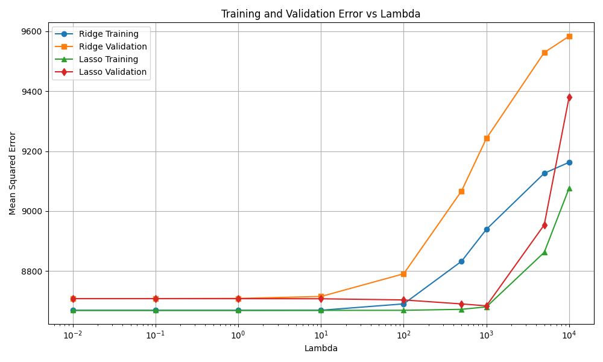
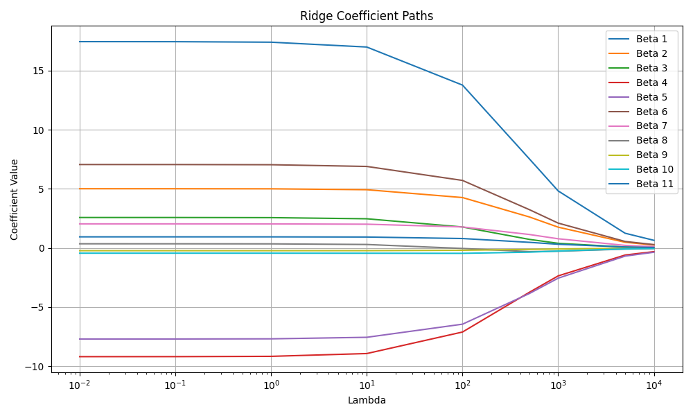
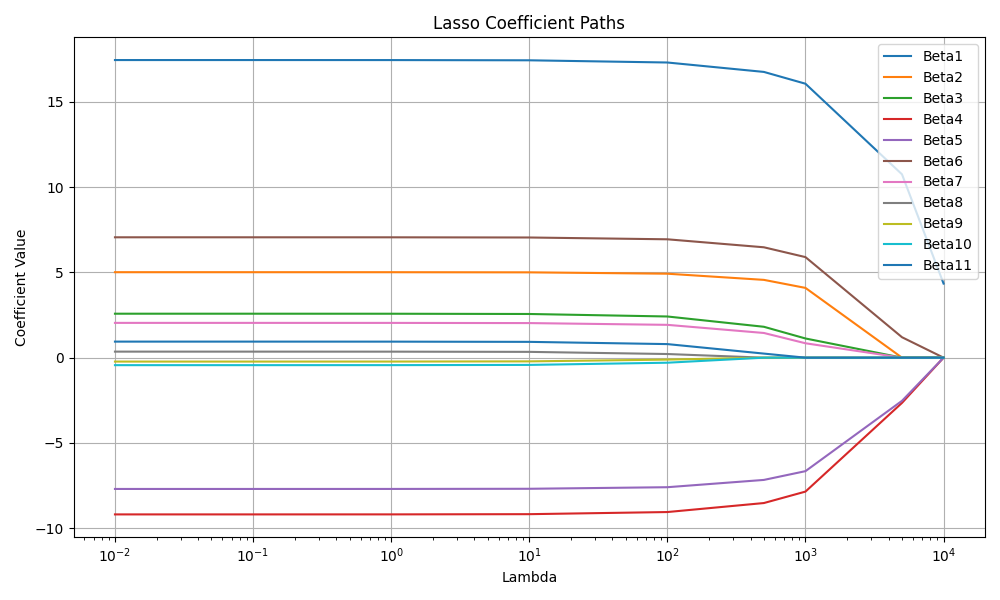

# Ridge and Lasso Regression Implementation

## Overview

This project implements Ridge Regression and Lasso Regression from scratch in C++ using the Eigen library.

The objective of this task is to understand regularization techniques and implement them without using external machine learning libraries.

The project includes:

- CSV dataset loading
- Train-validation split
- Feature standardization
- Ridge Regression using closed-form solution
- Lasso Regression using coordinate descent
- Hyperparameter tuning using different λ values
- Training and validation MSE calculation
- Coefficient path generation
- Training time comparison using C++ chrono library


## Algorithms Implemented

### Ridge Regression

Ridge Regression uses L2 regularization to reduce model complexity by penalizing large coefficient values.

The optimization problem is solved using the closed-form solution:

β = (XᵀX + λI)⁻¹Xᵀy
where λ controls the strength of regularization.

As λ increases:
- Coefficients shrink towards zero
- Model variance reduces
- Coefficients generally do not become exactly zero


### Lasso Regression

Lasso Regression uses L1 regularization:

‖y − Xβ‖² + λ‖β‖₁

Unlike Ridge, Lasso can force coefficients to become exactly zero, resulting in feature selection.

The implementation uses coordinate descent with soft-thresholding.

A detailed explanation of the coordinate descent implementation is provided in:

`Lasso_Coordinate_Descent.md`


## Dataset and Preprocessing

The model is trained on a house prices dataset.

Before training:

1. The dataset is split into training and validation sets.
2. Features are standardized using the mean and standard deviation calculated only from the training data.
3. The same transformation is applied to the validation data to avoid data leakage.


## Hyperparameter Selection

Multiple λ values are tested to study the effect of regularization:

```
0.01, 0.1, 1, 10, 100, 500, 1000, 5000, 10000
```

A range of values is used because the effect of regularization is usually observed on a logarithmic scale.


## Output Files

The program generates three CSV files.

### errors.csv

Contains:

- λ values
- Ridge training MSE
- Ridge validation MSE
- Lasso training MSE
- Lasso validation MSE
- Ridge training time
- Lasso training time


### ridge_coefficients.csv

Stores Ridge regression coefficients for every λ value.

This file is used to visualize how coefficients shrink with increasing regularization.


### lasso_coefficients.csv

Stores Lasso regression coefficients for every λ value.

This file demonstrates the sparsity property of Lasso, where less important features are removed by reducing their coefficients to exactly zero.


## Compilation

Compile the program using:

```bash
g++ Ridge_Lasso.cpp -o Ridge_Lasso.exe -I"path_to_eigen"
```

Run:

```bash
./Ridge_Lasso.exe
```


## Results

## Training and Validation Error vs Lambda




---

## Ridge Coefficient Paths




---

## Lasso Coefficient Paths



---


# Libraries Used

### C++

- Eigen
- chrono

### Python

- csv
- matplotlib

---


## Folder Structure

```
Week4/
│
├── Ridge_Lasso.cpp
├── plot_results.py
├── README.md
├── Lasso_Coordinate_Descent.md
├── errors.csv
├── ridge_coefficients.csv
├── lasso_coefficients.csv
├── mse_vs_lambda.png
├── ridge_coefficient_path.png
└── lasso_coefficient_path.png
```
